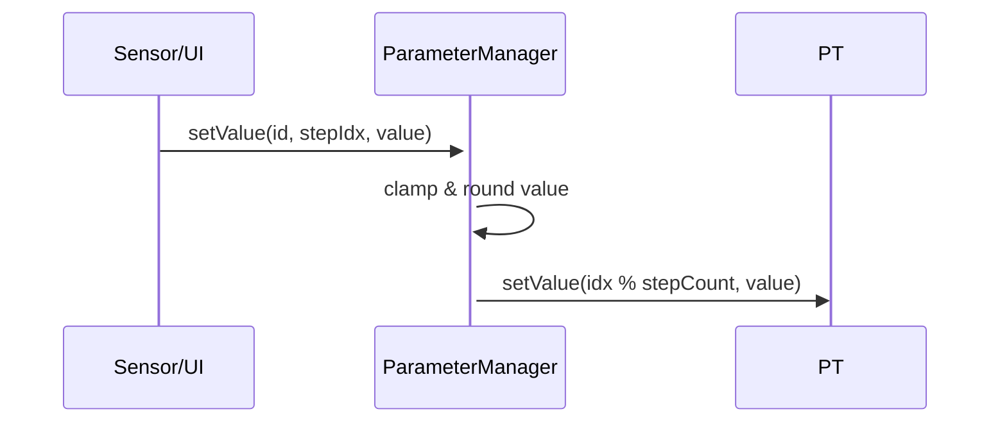
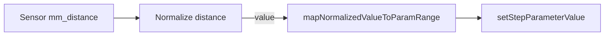

# Sequencer Module

The Sequencer module implements the polyrhythmic step sequencer core for the PicoMudrasSequencer, enabling independent parameter track sequencing with real-time gesture control. Each parameter (Note, Velocity, Filter, Attack, Decay, Octave, GateLength, Gate, Slide) operates as an independent track with configurable step counts, creating complex evolving patterns.

---

## Overview

The sequencer architecture separates parameter management from audio synthesis, enabling sophisticated polyrhythmic patterns while maintaining real-time performance. Each parameter track can have its own length (2-64 steps), and patterns repeat only after reaching the least common multiple of all track lengths—creating compositions that evolve over hundreds of steps.

### Key Features

- **Polyrhythmic Parameter Tracks**: Each parameter advances independently with configurable step counts
- **Real-Time Parameter Recording**: Hold parameter buttons and use sensors to record values instantly
- **Thread-Safe Operation**: Designed for dual-core architecture with volatile VoiceState communication
- **Dual Voice Architecture**: Two independent sequencer instances for layered compositions
- **Gesture-Based Control**: Integration with distance sensors and magnetic encoders

---

## Architecture

### Core Components

The sequencer module consists of three primary components that work together to provide polyrhythmic parameter sequencing:

#### 1. SequencerDefs.h - Data Structures

Defines the fundamental data structures and parameter system:

<augment_code_snippet path="src/sequencer/SequencerDefs.h" mode="EXCERPT">
````cpp
enum class ParamId : uint8_t {
    Note, Velocity, Filter, Attack, Decay, Octave,
    GateLength, Gate, Slide, Count
};

struct VoiceState {
    float note, velocity, filter, attack, decay, octave;
    uint16_t gateLength;
    bool gate, slide, retrigger;
};
````
</augment_code_snippet>

#### 2. ParameterManager - Track Management

Manages independent parameter tracks with thread-safe access:

<augment_code_snippet path="src/sequencer/ParameterManager.h" mode="EXCERPT">
````cpp
class ParameterManager {
public:
    void setStepCount(ParamId id, uint8_t steps);  // Set track length
    float getValue(ParamId id, uint8_t stepIdx) const;
    void setValue(ParamId id, uint8_t stepIdx, float value);

private:
    ParameterTrack<SEQUENCER_MAX_STEPS> _tracks[ParamId::Count];
    spin_lock_t* _lock;  // Thread-safe access
};
````
</augment_code_snippet>

#### 3. Sequencer - Core Logic

Implements polyrhythmic sequencing with independent parameter advancement:

<augment_code_snippet path="src/sequencer/Sequencer.h" mode="EXCERPT">
````cpp
class Sequencer {
private:
    uint8_t currentStepPerParam[ParamId::Count]; // Independent step counters
    ParameterManager parameterManager;

public:
    void advanceStep(uint8_t current_uclock_step, /* sensor params */);
    void processStep(uint8_t stepIdx, volatile VoiceState* voiceState);
    uint8_t getCurrentStepForParameter(ParamId paramId) const;
};
````
</augment_code_snippet>

---

## Polyrhythmic Step Advancement Flow

[`mermaid.declaration()`](src/sequencer/README.md:52)
```mermaid
flowchart TD
    A[Start Sequencer] --> B{Running?}
    B -- No --> Z[Exit]
    B -- Yes --> C[Compute currentStep for Gate timing]
    C --> D[For each Parameter ID]
    D --> E[Compute currentStepPerParam[i] = uclock_step % paramStepCount]
    E --> F{More Parameters?}
    F -- Yes --> D
    F -- No --> G{Real-time Edit?}
    G -- Yes --> H[Record Parameter using currentStepPerParam[paramId]]
    G -- No --> I[processStep using currentStepPerParam for each parameter]
    H --> I
    I --> J[Update VoiceState]
    J --> Z
```

1. Check `running` flag.
2. Calculate `currentStep` using UClock step and Gate track length (for timing reference).
3. **Calculate `currentStepPerParam[i]` for each parameter independently** using its own step count.
4. If in edit mode (`current_selected_step_for_edit == -1`), record sensor values using each parameter's current step.
5. Call [`processStep`](src/sequencer/Sequencer.cpp:236) which uses per-parameter step indices.

---

## Polyrhythmic Parameter Management

The [`ParameterManager`](src/sequencer/ParameterManager.h:1) stores per-parameter tracks using [`ParameterTrack`](src/sequencer/SequencerDefs.h:37). Each track:
- Has up to `SEQUENCER_MAX_STEPS` values.
- Maintains an **independent `stepCount`** (configurable per parameter via `setParameterStepCount()`).
- Wraps indices with modulo arithmetic: `stepIdx % stepCount`.
- **Advances independently** from other parameter tracks, enabling polyrhythmic patterns.

[`mermaid.declaration()`](src/sequencer/README.md:76)


### Clamping and Rounding

Parameters are clamped to `minValue`/`maxValue` in [`CORE_PARAMETERS`](src/sequencer/SequencerDefs.h:108) and rounded if integer or binary.

---

## Polyrhythmic Pattern Examples

### Basic Polyrhythm Setup

```cpp
Sequencer seq;
seq.initializeParameters();

// Configure different track lengths for polyrhythmic behavior
seq.setParameterStepCount(ParamId::Gate, 4);     // 4-step rhythm pattern
seq.setParameterStepCount(ParamId::Note, 3);     // 3-step melodic pattern
seq.setParameterStepCount(ParamId::Velocity, 5); // 5-step dynamic pattern
seq.setParameterStepCount(ParamId::Filter, 2);   // 2-step timbral pattern

// Set pattern values
seq.setStepParameterValue(ParamId::Gate, 0, 1.0f);    // ON
seq.setStepParameterValue(ParamId::Gate, 1, 0.0f);    // OFF
seq.setStepParameterValue(ParamId::Gate, 2, 1.0f);    // ON
seq.setStepParameterValue(ParamId::Gate, 3, 1.0f);    // ON

seq.setStepParameterValue(ParamId::Note, 0, 0.0f);    // C
seq.setStepParameterValue(ParamId::Note, 1, 2.0f);    // D
seq.setStepParameterValue(ParamId::Note, 2, 4.0f);    // E
```

### Pattern Evolution

With the above configuration, the pattern evolves as follows:

| Clock Step | Gate | Note | Velocity | Filter | Combination |
|------------|------|------|----------|--------|-------------|
| 0          | ON   | C    | 0.2      | 0.3    | G0 N0 V0 F0 |
| 1          | OFF  | D    | 0.4      | 0.7    | G1 N1 V1 F1 |
| 2          | ON   | E    | 0.6      | 0.3    | G2 N2 V2 F0 |
| 3          | ON   | C    | 0.8      | 0.7    | G3 N0 V3 F1 |
| 4          | ON   | D    | 1.0      | 0.3    | G0 N1 V4 F0 |
| ...        | ...  | ...  | ...      | ...    | ...         |

**Key Insight**: The full pattern repeats every **LCM(4,3,5,2) = 60 steps**, creating 60 unique combinations before returning to the initial state.

### Musical Benefits

- **Rhythmic Evolution**: Gate track creates varying rhythmic patterns
- **Melodic Variation**: Note track cycles through different pitch sequences
- **Dynamic Expression**: Velocity track adds evolving dynamics
- **Timbral Changes**: Filter track provides cyclical timbral variation
- **Compositional Depth**: Combined patterns create complex, non-repetitive sequences

---

## Real-time Parameter Editing

When `current_selected_step_for_edit == -1` (no step selected), sensor inputs map to parameters:  
- Sensor distance → normalized [0.0–1.0].  
- Mapped to parameter range via [`mapNormalizedValueToParamRange`](src/sequencer/Sequencer.cpp:30).  
- Special case for `Octave`: mapped to discrete values -1, 0, or +1.

[`mermaid.declaration()`](src/sequencer/README.md:97)


---

## Processing a Step with Polyrhythmic Parameters

[`processStep`](src/sequencer/Sequencer.cpp:236) handles:
1. **Fetch parameters using independent step indices**: Each parameter uses `currentStepPerParam[paramId]` instead of a single step index.
2. Get Gate, Filter, Attack, Decay, Note, Velocity, Octave, Slide, GateLength from their respective current steps.
3. Compute `noteDurationTicks = max(1, gateLength * PULSES_PER_SEQUENCER_STEP)`.
4. Map `octave` float to semitone offset via [`mapFloatToOctaveOffset`](src/sequencer/Sequencer.cpp:13).
5. If `gateOn`:
   - Without slide: retrigger envelope & call `startNote()`.
   - With slide: update `currentNote` & extend duration.
6. If `gateOff`: call `handleNoteOff()`.
7. Update [`VoiceState`](src/sequencer/SequencerDefs.h:122) for audio engine.

**Key Change**: Each parameter value is retrieved using its own current step position, enabling true polyrhythmic behavior where different parameters can be at different positions in their respective sequences.

---

## Note Lifecycle

1. [`startNote`](src/sequencer/Sequencer.cpp:284): stores note state, triggers envelope, starts duration counter.  
2. [`tickNoteDuration`](src/sequencer/Sequencer.cpp:318) decrements countdown; on expiry calls `handleNoteOff()`.  
3. [`handleNoteOff`](src/sequencer/Sequencer.cpp:295): sends MIDI note-off, releases envelope, resets state.

---

## API Reference

| Method                          | File                                               | Description                                |
|---------------------------------|----------------------------------------------------|--------------------------------------------|
| `initializeParameters()`        | [`Sequencer.cpp`](src/sequencer/Sequencer.cpp:63)  | Initialize all parameter tracks.           |
| `advanceStep(...)`              | [`Sequencer.cpp`](src/sequencer/Sequencer.cpp:126) | Main tick: optional recording + processing.|
| `processStep(stepIdx)`          | [`Sequencer.cpp`](src/sequencer/Sequencer.cpp:211) | Apply parameter values to voice state.     |
| `startNote(note, vel, dur)`     | [`Sequencer.cpp`](src/sequencer/Sequencer.cpp:284) | Trigger note-on and envelope.              |
| `handleNoteOff(state)`          | [`Sequencer.cpp`](src/sequencer/Sequencer.cpp:295) | Trigger note-off and reset envelope.       |
| `randomizeParameters()`         | [`Sequencer.cpp`](src/sequencer/Sequencer.cpp:363) | Randomize all parameter tracks.            |

---

## Example Usage

### Basic Setup
[`cpp.declaration()`](src/sequencer/README.md:206)
```cpp
Sequencer seq;
seq.initializeParameters();

// Configure polyrhythmic pattern lengths
seq.setParameterStepCount(ParamId::Gate, 8);      // 8-step rhythm
seq.setParameterStepCount(ParamId::Note, 5);      // 5-step melody
seq.setParameterStepCount(ParamId::Velocity, 3);  // 3-step dynamics

// In audio callback:
seq.advanceStep(uclockStep, mmDist, btnNote, btnVel, btnFilt, btnAtk, btnDec, btnOct, -1, &voice);
seq.tickNoteDuration(&voice);
```

### Advanced Polyrhythmic Setup
```cpp
// Create complex evolving patterns
seq.setParameterStepCount(ParamId::Gate, 4);      // Rhythm: 4 beats
seq.setParameterStepCount(ParamId::Note, 7);      // Melody: 7 notes
seq.setParameterStepCount(ParamId::Velocity, 5);  // Dynamics: 5 levels
seq.setParameterStepCount(ParamId::Filter, 3);    // Timbre: 3 settings
seq.setParameterStepCount(ParamId::Attack, 2);    // Envelope: 2 attacks

// Pattern repeats every LCM(4,7,5,3,2) = 420 steps!
// This creates 420 unique combinations before repeating
```

---

## Related Modules

| Module                 | File                                                 | Purpose                             |
|------------------------|------------------------------------------------------|-------------------------------------|
| `LEDMatrixFeedback`    | [`LEDMatrixFeedback.cpp`](src/LEDMatrix/LEDMatrixFeedback.cpp:1) | Visual feedback on step & parameters. |
| `Matrix`               | [`Matrix.cpp`](src/matrix/Matrix.cpp:1)              | Touch/button event management.      |

---

## Contributing

Contributions welcome. Please update documentation for any changes to `CORE_PARAMETERS` or step logic.

---

## See Also

- [Main README](../../README.md)  
- [Programmer's Manual](../../PROGRAMMERS_MANUAL.md)
